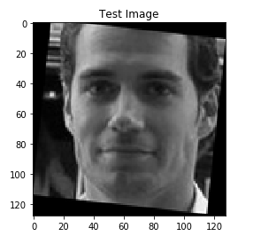
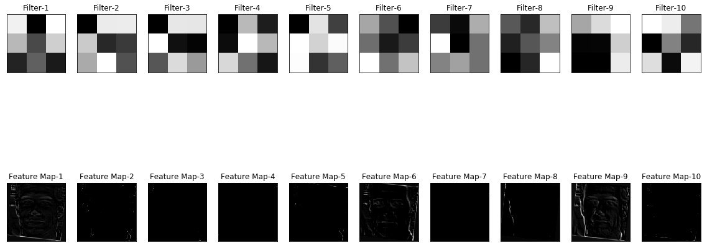
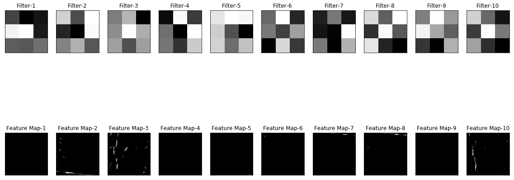
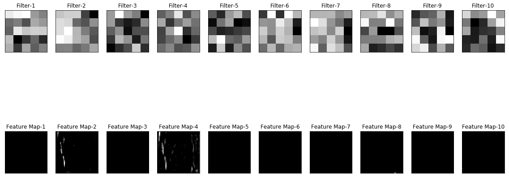
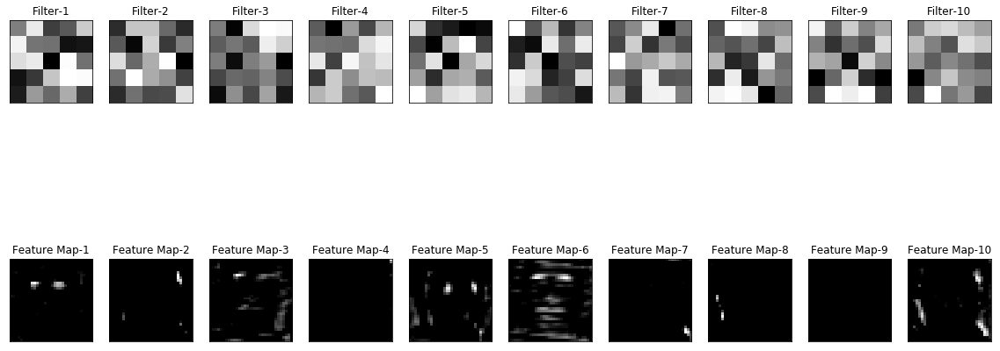
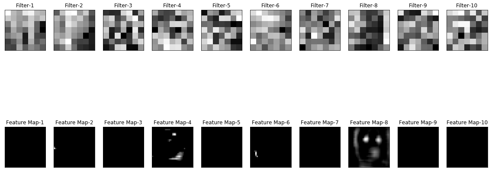
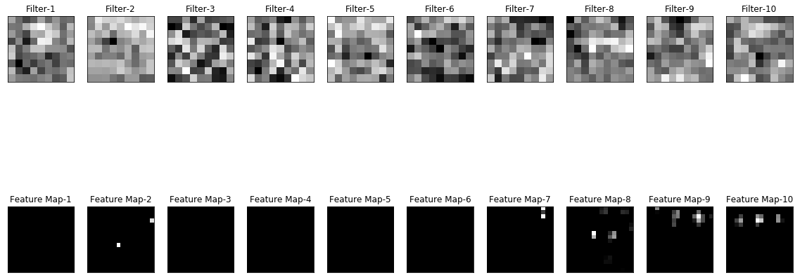

# Visualizing CNN

Have you ever wondered what's happening with the filters in a CNN and what are the filters actually doing ?

I've trained a CNN with 6 convolutional layers on face and non face images. The dataset is included as well in this repo.

For the next step, I've used one of the test image to get the feature maps and the filter weights in each and every layer. 

**Example :**

**Test Image**

_Below, the weights of the filters are normalized and visualized as images and the row below every filter is the feature map produced by the filter during the convolution process on the shown test image._

**Convolution Layer 1**

**Convolution Layer 2**

**Convolution Layer 3**

**Convolution Layer 4**

**Convolution Layer 5**

**Convolution Layer 6**

License
----

MIT